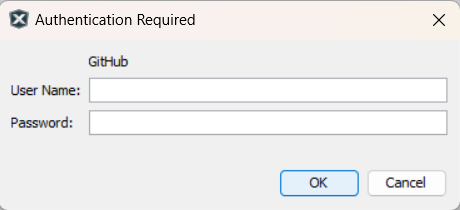

# MSEC MCU Secure Drivers

This repository contains the source code and documentation for Microchip's MCU Security Drivers. These drivers provide easy access to configure and use security hardware peripherals in PIC32 devices.

- [Release Notes](./release_notes.md)

# Contents Summary

| Folder    | Description                                                        |
| --------- | ------------------------------------------------------------------ |
| puf       | PUF (Physical Unclonable Function) driver source and documentation |
| hsm_llite | HSM Lite CAM (Crypto Acceleration Module) driver source            |

## Documentation

| Driver    | API Reference | User Guide |
| --------- | ------------- | ---------- |
| PUF       | [API Reference](https://onlinedocs.microchip.com/v2/keyword-lookup?keyword=puf_api_ref&redirect=true) | [User Guide](https://onlinedocs.microchip.com/v2/keyword-lookup?keyword=puf_user_guide_intro&redirect=true) |
| HSM Lite  | TBD | TBD |

## Supported Devices

| Driver    | Devices         |
| --------- | --------------- |
| PUF       | PIC32CM SG00    |
| HSM Lite  | PIC32CK SG/GC  |

## Development Tools

- [MPLAB® X IDE v6.20](https://www.microchip.com/mplab/mplab-x-ide) or higher
- [MPLAB® XC32 C/C++ Compiler v4.45](https://www.microchip.com/en-us/tools-resources/develop/mplab-xc-compilers) or higher

## Installation

### Prerequisites

- Python 3.8 or higher
- PyYAML package (`pip install pyyaml`)

### Install the package

The `scripts/install_module.py` script installs the Secure Drivers package into your local MPLAB Harmony Content folder.

**Option 1: Auto-detect Harmony Content path**

```
python scripts/install_module.py
```

The script will automatically locate the Harmony Content path from your MPLAB IDE configuration.

**Option 2: Specify Harmony Content path manually**

```
python scripts/install_module.py <path_to_harmony_content>
```

For example:

```
python scripts/install_module.py C:\Users\myuser\MicrochipHarmony
```

### Note: GitHub credentials popup when opening MCC

After installation, when you open MCC (MPLAB Code Configurator), a floating window may appear requesting GitHub username and password:



Simply click the **"Cancel"** button to dismiss this window. The Secure Drivers package is installed locally and does not require GitHub authentication to function.
